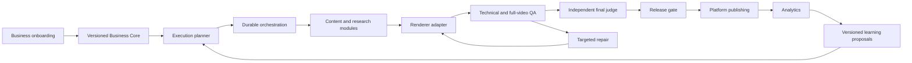

# Target architecture

Status: proposed foundation design, based on [existing system](EXISTING_SYSTEM.md). No runtime stack is installed.

## Shape

Use a TypeScript modular backend with a separate render worker, rather than deploying one service for every business capability immediately. This preserves the existing TypeScript/Remotion boundary and keeps transactional state in one place. Modules can become services only when measured scaling or security needs justify it.

Proposed runtime: web/API, durable orchestration worker, isolated rendering worker, PostgreSQL-style transactional store, object storage, secret manager. Database and workflow products remain unselected until blueprint inventory and operational constraints are known. Required semantics: persisted timers, retries, leases, cancellation, transactional outbox/inbox and recovery after process failure.



## Proposed monorepo

```text
apps/web/                     onboarding, business plan and review UI
apps/api/                     authenticated commands and business views
workers/orchestration/        durable execution, timers and provider calls
workers/rendering/            process isolation and legacy renderer adapter
packages/business-core/       profiles, onboarding definitions and validation
packages/contracts/           versioned commands, events and artifact contracts
packages/planning/            capability registry and plan validation
packages/content/             discovery through research, script and assets
packages/quality/             issues, repair routing and release evaluator
packages/publishing/          platform payloads and reconciliation
packages/analytics/           metric ingestion and normalization
packages/learning/            experiments, policy versions and rollback
packages/providers/           ports and provider-specific adapters
packages/persistence/         tenant-scoped repositories and outbox
packages/config/              validated configuration, no credentials
docs/                         decisions and evidence
legacy/make-blueprints/        controlled legacy intake
```

Only documentation directories are bootstrapped now. Do not create empty executable packages or copy the renderer into the core. There is no dependency on Make in the desired normal production path.

## Boundaries

Business Core owns business facts and versioned rules; modules consume immutable profile snapshots. Provider adapters cannot write policy directly. The planner chooses from registered, tested capabilities and validates prerequisites, budgets and hard constraints. Model output is an untrusted plan proposal, never arbitrary executable code.

Content stores one research revision with separate SHORT/LONG production variants. BOTH shares research but has distinct hooks, scripts, scenes, render contracts, packaging and per-platform releases. A horizontal composition alone does not establish a longform production capability.

Rendering accepts an immutable artifact request and returns an artifact result. It cannot call publishing. The publisher must independently check the current release record and content hash immediately before each external side effect.

## Isolation and execution

Every command is authorized against tenant membership; business_id comes from authorized server context, not merely request JSON. Composite tenant foreign keys, row access policies and tenant-prefixed object paths prevent accidental joins across businesses. Credentials are resolved inside tenant-scoped adapters. Worker claims carry tenant and business context; caches and idempotency are equally scoped.

Each run pins profile, plan, policy, compiler, renderer and input-asset revisions. Costs use reservation before dispatch and settlement after completion. Exhausted budget produces a pause, never a cheaper unapproved provider or skipped QA.

Job/run/content/business IDs, provider call IDs, input/output hashes, costs, timestamps, errors, retries and gate evidence are recorded as events. Logs redact payload secrets; object data has retention and deletion policy. Global learning receives only explicitly eligible aggregated observations.

## Provider ports

LLM, research, image, video, voice, full-video QA, publishing and analytics ports expose capability metadata, version, submit/poll/cancel where supported, timeout/error classification, cost usage and credential reference. The adapter must report unsupported features rather than silently downgrade. Gemini is the named initial full-video QA candidate from the source specification; full-video/audio support and limits must be verified before implementation. No live provider was called in Phase 0.
