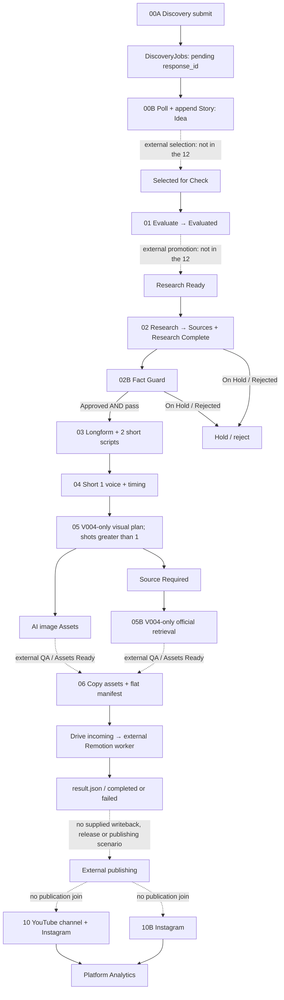

# Current Make scenario map

Audit date: 2026-09-13. **12 original exports; complete set explicitly confirmed by owner; 81 modules fully statically reviewed.** [Scenario audits](make/README.md) contain each module, route, prompt policy, output schema and Sheets mapping. [Import manifest](../legacy/make-blueprints/IMPORT_STATUS.json) records exact filenames and SHA-256 identities.

This map supersedes the earlier System Map inventory wherever it described unverified Make behavior. It establishes configured behavior, not current activation, schedule frequency or execution success. The supplied complete set does not include run histories or all external operational steps.

## Runtime overlay — VERIFIED artifacts, attribution limited

V004 traversed retained snapshots Idea → Needs Review → Voice Ready → Visual Assets Pending QA → Assets Ready → Render Queued, with gaps between snapshots. These arrows show chronological observations, not direct transitions. The complete dated trace and field-level handoffs are in [runtime validation](LEGACY_RUNTIME_VALIDATION.md). Four completed render attempts on Sep13 are VERIFIED; all contain eight visual shots including Shot1 and the same nine input assets. Production still says Queued after success. No Make result consumer is supplied.

Shot1 absence from the actual render is disproved. Its creation predates the later AI image batch by about 11 minutes; a resume-specific exclusion is INFERRED, its intent UNVERIFIED. Current 05/05B V004 predicates remain VERIFIED configuration. Active schedules and individual historical scenario attribution remain UNVERIFIED.

## Configured flow and external boundaries

Dotted transitions identify required or conceptual external boundaries, not evidence that a specific person or service performs them. Render-result → publishing is not an authorized or implemented automatic path.

## Complete scenario inventory

| Scenario | Entry selection / first action | Configured result | Main handoff |
| --- | --- | --- | --- |
| [00A – Idea Discovery Submit](make/00A.md) | Model call with web search, background=true | Pending discovery job | Data Store response ID |
| [00B – Idea Discovery Results](make/00B.md) | Pending jobs, limit 10 | Story Idea; job state | Story Pipeline |
| [01 – Story Evaluator](make/01.md) | Selected for Check, limit 1 | Evaluated, scores + narrative | External Research Ready transition |
| [02 – Research Agent](make/02.md) | Research Ready, limit 1 | Claim/source rows + Research Complete/On Hold/Rejected | Sources + Story |
| [02B – Fact Guard](make/02B.md) | Research Complete; associated Sources | pass/hold/reject + Approved/On Hold/Rejected | Corrections/guardrails to 03 |
| [03 – Script & Production Package](make/03.md) | Approved AND pass, limit 1 | Longform package + 2 shorts; Script Drafted | Production Pipeline |
| [04 – Voice Production](make/04.md) | Script Drafted or Assets Ready, Short 1 script present, timing absent | Voice + alignment; Voice Ready or preserved Assets Ready | Audio Asset + AF timing |
| [05 – Short Visual Production](make/05.md) | Voice Ready, fixed V004, script + scene plan present | AE shot plan; images/source requests for shots >1 | Asset Library; Pending QA |
| [05B – Official Visual Retrieval](make/05B.md) | Source Required, file absent, fixed V004 | Retrieved–Needs Review or failure/Blocked | Official Asset + provenance |
| [06 – Render Handoff](make/06.md) | Assets Ready, limit 1 | Render Queued, flat assets + manifest | External queue worker |
| [10 – Platform Analytics](make/10.md) | YouTube channel query then first IG media | Channel and media observations | Platform Analytics |
| [10B – Instagram Analytics](make/10B.md) | First IG media | Same IG observation logic as 10 | Platform Analytics |

All first actions are non-instant in exported metadata. No frequency is inferred from names such as Daily Export or from the historical workbook.

## Shared resources

Aliases below replace real IDs; exact operational references remain in ignored originals. IDs were compared in original exports and verified against bounded read-only Drive/Sheets evidence; no generation or publishing provider was called.

| Resource alias | Users | Role |
| --- | --- | --- |
| S-MASTER / Master Database | Every scenario except 00A | Same spreadsheet identity, expressed either as ID or picker path |
| Story Pipeline | 00B, 01, 02, 02B, 03, 04 | Story identity, selection/research/factual/narrative status |
| Sources | 02, 02B | Claim-to-source evidence rows |
| Production Pipeline | 03, 04, 05, 06 | Scripts, JSON plans/timings and production state |
| Asset Library | 04, 05, 05B, 06 | Voice/image/source files, rights, AI flag, QA metadata |
| Platform Analytics | 10, 10B | Mixed channel and media observations |
| DiscoveryJobs / Make Data Store | 00A, 00B | Same async response record store |
| D-AUDIO / logical ShortsAudio destination | 04 | MP3 assets |
| D-VISUAL / logical VisualsShorts destination | 05, 05B | Same image/official file destination |
| D-QUEUE-INCOMING | 06 + external worker | Same flat manifest and asset intake boundary |

Column contracts are in [DATA_MODEL](DATA_MODEL.md) and the [full exported dictionary](make/COLUMN_DICTIONARY.md). Other workbook tabs (Content Calendar, Costs, Build Log, Settings, Visual Gate, Automation Control, System Map, Story Archive, Dashboard) have **no direct module read/write** in these 12 exports. Their existence is not proof of an implemented capability.

## What ARKTROV currently has evidence for

The configuration is an ARKTROV-specific, Sheets-driven editorial and Short 1 production chain. Prompts research and fact-check before scripting; 03 creates a longform package, but voice, visual and handoff modules consume Short 1. 05/05B restrict visuals to V004; current 05 creation routes omit Shot1, although the historical V004 artifacts include it. Rendering is delegated to the existing Drive-synchronized external Remotion project. Prior foundation evidence includes a successful V004 V4 render; it does not establish full-video QA or a complete automated production run.

Analytics is a separate read/append branch for already existing YouTube/Instagram content. The IG tails in 10 and 10B are semantically identical; whether both are active remains unverified. No publisher or per-publication analytics checkpoint owner appears in the complete set.

## Boundaries missing from the complete set

No scenario produces Selected for Check, Research Ready or Assets Ready. No supplied current scenario explains the already-existing initial visual, independently approves retrieved/generated assets, consumes renderer results into Sheets, performs final-video QA/repair/judge/release, or publishes. Longform rendering, Short 2 assets, multi-platform packaging, measured cost attribution, tenant configuration and learning are also outside this implementation.

These are **coverage gaps**, not silently discarded functions and not a request for more blueprint files after completeness confirmation. Establish the current external actor and evidence for each boundary before proposing replacement.

## Runtime coverage and remaining evidence

VERIFIED: Sources has 47 other-story rows and no V004 rows; Analytics, Content Calendar and Automation Control contain headers only in captured ranges/full ID sentinels. Visual Gate has no populated target review/result. Current D-AUDIO/D-VISUAL names resembling slash paths are actual sibling folder names. No live schema or folder was changed. UNVERIFIED schedule/activation and four representative run gaps are listed precisely in [runtime validation](LEGACY_RUNTIME_VALIDATION.md); no blanket execution export is needed.
